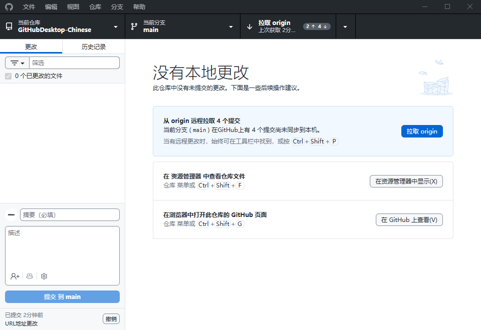
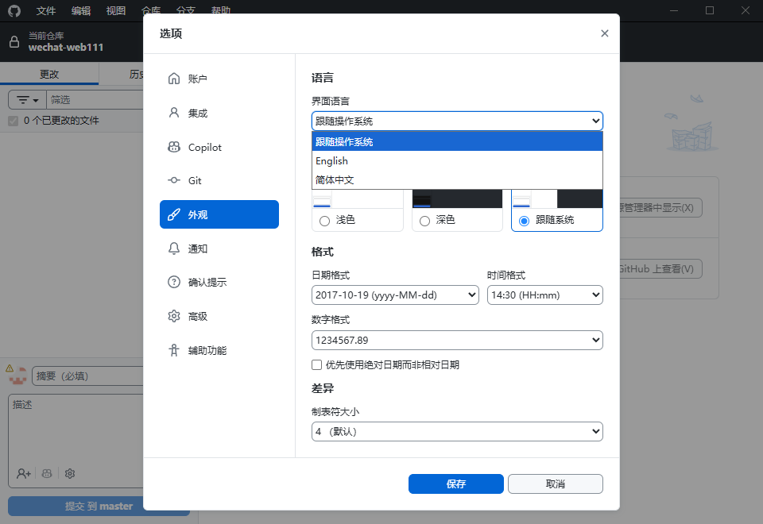
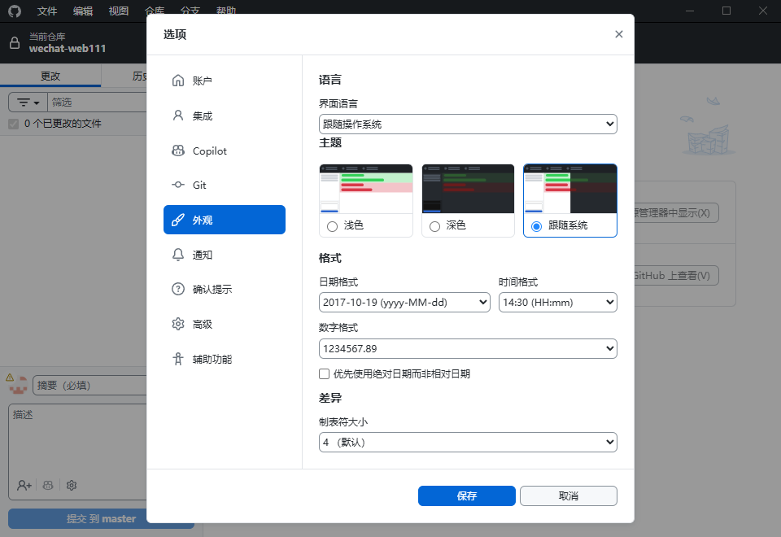

# Desktop-Chinese（GitHub Desktop 中文汉化版）

基于 [GitHub Desktop](https://desktop.github.com/) 的中文汉化版本。在保留原版完整功能的基础上，对用户界面进行了全面的简体中文本地化。

> **当前仅提供 Windows X64 平台汉化，暂无 macOS 版本。**

---

## 下载安装

前往 [Releases](https://github.com/DXER666/Desktop-Chinese/releases/latest) 下载最新 Windows 安装包。

---

## 软件截图

### 主界面

完整的中文 Git 工作流界面，包括仓库切换、分支管理、提交、拉取/推送等全部功能。



### 设置面板

全中文的设置界面，涵盖账户、集成、Git、外观、通知等所有设置选项。



### 语言切换

支持随时在 **简体中文 / English / 跟随操作系统** 之间切换，无需重启软件。



---

## 汉化内容

- 菜单栏（文件、编辑、视图、仓库、分支、帮助）
- 仓库切换、分支管理、提交历史
- 设置面板（通用、账户、外观、高级等）
- 各类对话框（新建分支、重命名、合并、变基等）
- 差异对比视图、无更改提示页
- GitHub Enterprise 登录页面
- 日期格式本地化
- 提交作者信息设置

---

## 构建开发环境

如需自行构建，参考原版文档：[`setup.md`](./docs/contributing/setup.md)。

```bash
# 安装依赖
yarn

# 编译开发版本
yarn compile:dev

# 启动应用
yarn start
```

---

## 安全反馈

如果您发现了项目安全隐患或逻辑缺陷请通过邮件提交：security@email.rjjm.dpdns.org我们会尽快核查并跟进处理,感谢您的贡献

---

## 相关项目

- [GitHub Desktop 原版](https://github.com/desktop/desktop)

---

## 赞助支持

如果这个项目对你有帮助，欢迎通过爱发电支持我：[前往爱发电赞助](https://ifdian.net/a/gdqbqql)

---

## 许可证

**[MIT](LICENSE)**

本项目基于 GitHub Desktop 原版代码进行汉化，遵循原版 MIT 许可证。

MIT 许可证授权不包括 GitHub 的商标，包括标志设计。GitHub 保留所有 GitHub 商标的商标和版权权利。使用 GitHub 标志时，请务必遵守 [GitHub 标志使用准则](https://github.com/logos)。